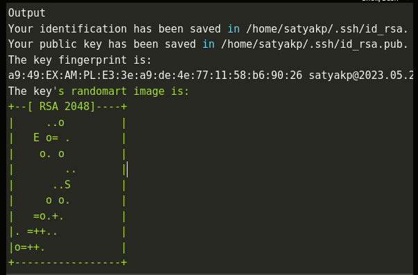
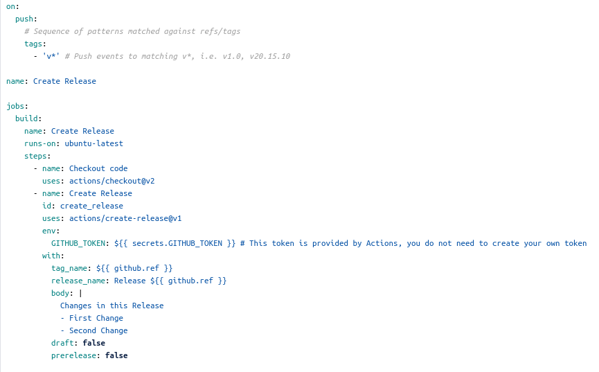
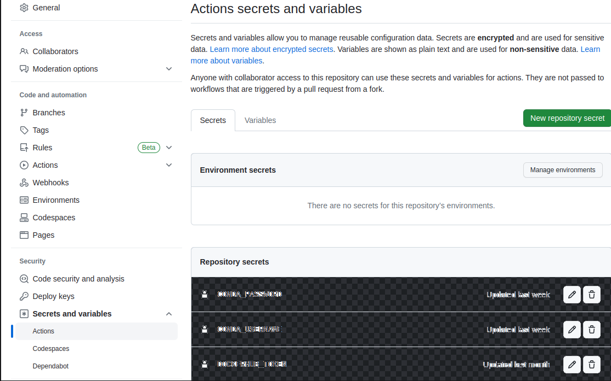
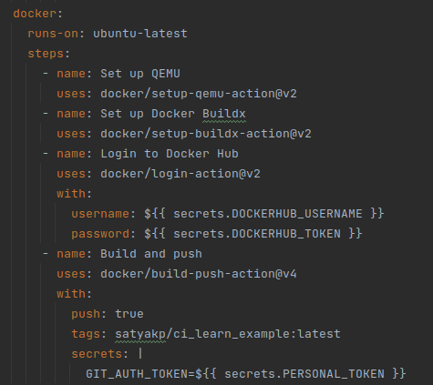
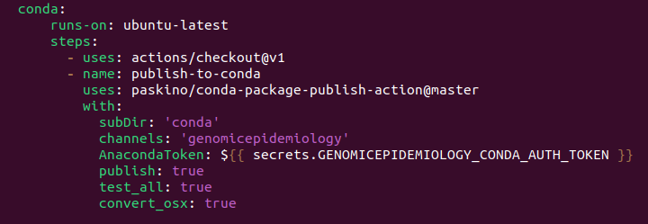

# Mirroring

## Generate the SSH keys
SSH keys are two long strings of characters that are used to authenticate the identity of user requesting for remote server. We generate the SSH kets with OpenSSh that are used for **macOS** or **Linux*>
$ ssh-keygen
**Prompt to select a location for keys**
**NOTE: By default, all ssh keys are stored under ~/.ssh directory with filenames id_rsa(private_key) and id_rsa.pub (public key).
**OUTPUT**
Generating public/private rsa key pair.
Enter the file to save the key (/home/satyakp/.ssh/id_rsa):
Following, your system will generate the SSH key pair:   
**Output is displayed as below**

  

## Setup deploy keys in GITHUB repository

To add the deploy keys on **Github** move to **Github repository**, **settings/deploy keys** add our generated public key from **bitbucket** is added and **writing permissions should be granted**.

## Create a custom bitbucket-pipeline.yml file

On **bitbucket repository**, create **bitbucket-pipelines.yml** file. 
Adjust the **name** accordingly inside the **custom**. For example, in the below picture, the name is **mirror-to-github** on line>

  

## Setup Github

### Create Github & workflow folder

In Github account, **create the workflows folder** and create a **release.yml file**.

## Create a custom github release.yml file

To customize the **release.yml** file, we recommend everyone to use the template as mentioned in the below image.

  

## Executing the workflow

We have two ways of executing workflows on **bitbucket**.
- The Branch view
- The commits section

To execute the workflow from **branch view** go to **bitbucket repository** and go to **branches** and run the **pipelines.yml**file by selecting the **run pipeline for branch**. Then click **run**
If you would like to execute the workflow from **commits section**, then go to **commits view** and select **run pipeline**. Then click **run**.

## Setup Github secrets for the release to CGE channels

To **generate secrets**,  go to **settings**, then **actions** and **add new repository secret**. The below image is the example on how to setup the secrets.

  

Refer these generated Tokens in the repository to use them in workflows and other configuration files.

# Releases:

## Required files for executing releases:

version.py - To maintain the sematic version of the application in python format.
Dockerfile - This file contains source path of the code that is build as dockerimage.
meta.yaml - This file contains the source code details of kma project which will be used to build in anaconda distribution.
conda_build_yaml_file - This file includes the channels and dependencies required for the project.
version.yaml - Workflow file that triggers the events, builds and helps to push the latest changes into dockerhub and anaconda distribution.

## Docker

Once the tag is created, create **dockerfile** and update the **dockerimage** on **Dockerhub**
1. Dockerfile contains the **source path of the project**
2. Create a account in **Dockerhub** and the **project repository**
3. Next, we would give the **project repository** in our **version.yaml** to publish the **code** into our **dockerhub**
4. For example, you can **refer the picture below at line with tags:**
5. **secrtes** are the login credentials of **dockerhub account** that should be stored in your **github-->settings-->actions-->secrtes**.

  

## Conda

We follow the same as **dockerhub** for **conda distribution**
1. We create a **conda folder** that includes **meta.yaml** file and **build.sh** file.
2. In **meta.yaml** file we will have the **package details**, **source path of project**, **requirements** and **Project information**.
3. In **build.sh** file we have the **install commands**
4. We then create **account** on **anaconda.org**
5. The **token** from **anaconda.org** is taken and passed into **github secrets** to publish the code on **anaconda distribution**.

  

## Releasing

When we want to create a new release, follow these steps:

1. Update the version in your project's **version.py** file(e.g: 1.2.3)
2. Commit the changes (**git commit -am v1.2.3**)
3. Tag your commit (**git tag v1.2.3**). Make sure your tag name's format is **v*.*.***. Your workflow will use this tag to detect when to create a release.
4. Push your changes to **Github** (**git push && git push --tags**)
